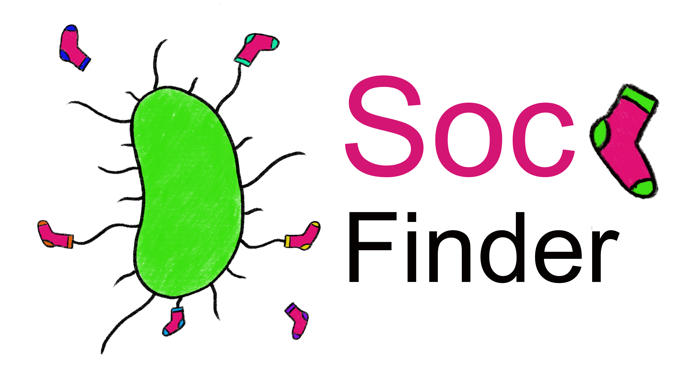

SOCfinder is a tool for finding cooperative genes in bacterial genomes.

## Installation

The easiest way to install is to clone this github page, or download the zip file https://github.com/lauriebelch/SOCfinder/archive/refs/heads/main.zip

You can then use the environment.yml file to create a conda environment with most of the required packages and tools

## Download SOCfinder scripts

```bash
git clone https://github.com/lauriebelch/SOCfinder.git
cd SOCfinder
conda env create -f environment.yml
```

## Install KOFAMscan

You might need to manually install KOFAMscan (its included in the conda packages, but I'm not sure)

You will need to edit the config.yml file in KOFAMscan


- altering KOFAM config file

You might need to add the exec_annotation file from KOFAMscan to your path


## make BLAST databases

You will need to build the databases that the BLAST search uses
```bash
./SOC_MakeBlastDB.py
```

## Tutorial

Here are some genomes blah blah

-- Part 1: Mine the Genome
```python
./SOC_parse.py -ac CP013821.1 -i P_salmonis/ -k inputs/SOCIAL_KO.csv -a inputs/antismash_types.csv
./SOC_parse.py -ac CP002703.1 -i B_aphidicola/ -k inputs/SOCIAL_KO.csv -a inputs/antismash_types.csv
```

-- Part 2: Extract the Social Genes
```python
./SOC_mine.py -g test/B_aphidicola.faa -f test/B_aphidicola.fna -gff test/B_aphidicola.gff -O B_aphidicola -n
./SOC_mine.py -g test/P_salmonis.faa -f test/P_salmonis.fna -gff test/P_salmonis.gff -O P_salmonis -n 
```

## User Options

**SOC_mine.py**

- `-g GENOMEinput`
  - Path to GENOME protein (.faa)
- `-f FASTAinput`
  - Path to GENOME nucleotide (.fna)
- `-gff GENOMEinput`
  - Path to GENOME gff file (.gff)
- `-O outputfolder`
  - Name of output folder
- `-p -n GramPositive | GramNegative`
  - Gram stain (positive | negative)

**SOC_parse.py**
- `-i inputfolder`
  - Path to input folder from SOC_mine
- `-ac accession`
  - Accession number
- `-k ko`
  - Path to list of social KO terms
- `-a ANTISMASHtypes`
  - Path to list of antismash types

## How to download genomes

The SOCfinder reccommended way to download the genome files you need is to use the [NCBI Datasets](https://www.ncbi.nlm.nih.gov/datasets/docs/v2/download-and-install/?utm_source=ncbi_insights&utm_medium=referral&utm_campaign=datasets-command-line-20221012) command line tool. This is so that gene ID is the same in protein fasta, nucleotide fasta, and gff. Otherwise users will have to check the gene ID .

```python
datasets download genome accession GCA_003798305.1 --include gff3,genome,protein
```

## Manuscript

-- link to preprint

## Contributing

Pull requests are welcome. For major changes, please open an issue first
to discuss what you would like to change.

## License

Free to use
